<!--
  Dmitry Vasiliev — GitHub Profile README
  Repo: swimmwatch/swimmwatch
-->

  

  

  
  
  

  
  

---

## 👋 About me

I’m a **Software Engineer (3+ years)** focused on backend development: **architecture, performance, reliability**, and developer productivity.  
My next step is **Tech Lead** — mentoring, engineering standards, and shipping sustainable systems.

**What I build**
- High-load APIs & async processing (queues, background jobs)
- Telegram/VK Mini Apps backends (product features + operational maturity)
- Observability-first systems (metrics/logs/alerts, prod debugging)
- Automation that saves time (CI/CD, code review helpers, dependency hygiene)

**Work format:** Remote · **Relocation:** Yes · **English:** B1

---

## 🧰 Tech stack

**Languages/Technologies:** Python · Go · JavaScript · HTML · CSS  
**Backend:** FastAPI · Django · Django Ninja · Celery · asyncio  
**Datastores:** PostgreSQL · Redis · MongoDB · Elasticsearch · OpenSearch · Weaviate  
**Messaging:** RabbitMQ · Kafka  
**Infra/DevOps:** Docker · Kubernetes · Nginx · Linux · GitLab CI · GitHub Actions · S3  
**Observability:** Prometheus · Grafana · Alertmanager · Loki  
**LLM tooling:** LangChain · LangGraph  
**Testing:** Pytest · Selenium · Playwright

---

## ✍️ Writing

**Russian (Habr)**
- [Как запоминать и не забывать: применяем и автоматизируем Spaced Repetition System](https://habr.com/ru/companies/doubletapp/articles/877524/)
- [От кнопки до продакшена: как мы делаем Telegram Mini Apps](https://habr.com/ru/companies/doubletapp/articles/917286/)
- [Меньше нагрузки — больше запросов: искусство кеширования API](https://habr.com/ru/companies/doubletapp/articles/928874/)

**English (Medium)**
- [How to Remember and Not Forget: Implementing and Automating the Spaced Repetition System](https://doubletapp.medium.com/how-to-remember-and-not-forget-implementing-and-automating-the-spaced-repetition-system-4c011afff83e)
- [From a Button to Production: How We Build Telegram Mini Apps](https://doubletapp.medium.com/from-a-button-to-production-how-we-build-telegram-mini-apps-c73e0c3a72c6)
- [Less Load — More Requests: The Art of API Caching](https://doubletapp.medium.com/less-load-more-requests-the-art-of-api-caching-33fce4aa5b2e)

---

## 🧩 Open source & collaboration

I maintain a few open-source tools that I originally built to solve real engineering problems: **security**, **API governance**, **automation**, and **developer productivity**.

**What I build (open source)**
- **Python libraries for Mini Apps authentication** (Telegram & VK): secure validation flow, type hints, tests, and developer-friendly docs.
- **GitHub Actions for OpenAPI governance**: detect breaking changes, compare spec versions, and suggest the right **SemVer bump** as part of CI.
- A lightweight **Django Ninja caching** integration built on top of the standard Django cache backend (useful for read-heavy endpoints).
- **Playwright testing utilities** for Python: helpers to work with **LocalStorage/SessionStorage** in E2E tests.
- Automation tooling: a **web page change detection** Action that can track updates and trigger notifications / issues in a repo.

If you maintain a backend project and want a contributor — **let’s talk**.

---

## 🏋️ A bit more

- I balance **quality × delivery speed** and take initiative
- Calm about criticism; always happy to give/receive feedback
- Continuous learning (courses, conference talks); planning to speak publicly
- Hobbies: open source · powerlifting · PlayStation

---

## 📊 GitHub stats

  

  

